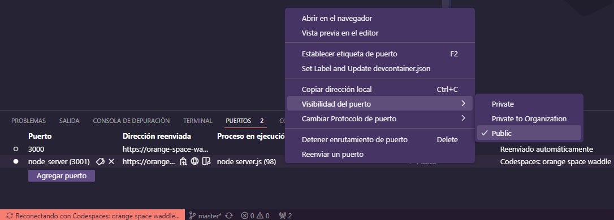

# `05` Valida tu instalación

Este paso es consiste en ejecutar un script de verificación para validar la configuración de la red NAT que creaste, para ello sigue los siguientes pasos:

## 1. CURL

Es una herramienta que permite hacer peticiones a una página web desde la terminal de tu sistema, también puede realizar otras funciones, pero ésta es la que nos ocupa en este caso.

Para windows debes descargar la herramienta de [este enlace](https://curl.se/windows/) y luego instalarla antes de continuar al siguiente paso.

Puedes omitir este paso si ya tienes curl previamente instalado

## 2. Habilitar el puerto público

Para que learnpack pueda recibir la información que se enviará desde tu maquina, es necesario habilitar el acceso público del puerto, que por seguridad viene privado por defecto.

Para ello selecciona la pestaña "Puertos" en el panel inferior de codespace, ahi verás los puertos que se están utilizando. Necesitas publicar el puerto `3001` y para ello has click con el botón derecho del mouse en el puerto, ve al menú `Visibilidad del puerto` y selecciona la opción `Público`

## 3. Script de validación

Es un script que hemos desarrollado a la medida de esta práctica. Se encarga de tomar la información de VirtualBox y enviarla para hacer la validación. Primero debes descargar el script y ejecutarlo el te solicitará una URL que puedes encontrar en el archivo `url.txt` que se encuentra en esta práctica.

[Descarga aquí el script de validación para Windows.](https://github.com/4GeeksAcademy/networks-on-virtualbox/blob/master/.learn/assets/sendDataWin.zip)

[Descarga aquí el script de validación para Linux.](https://github.com/4GeeksAcademy/networks-on-virtualbox/blob/master/.learn/assets/sendDataBash.zip)

Recuerda extraer el archivo antes de ejecutarlo en el equipo anfitrión.

## 4. Ejecuta la prueba

Una vez ejecutado el script con éxito, podrás ejecutar la prueba para validar tu instalación de Windows en VirtualBox.

## 5. ¡Listo!

Si lograste pasar las pruebas, ya has creado una red NAT en VirtualBox y has conectado una maquina virtual Debian y otra Windows entre sí con esta red. De esta forma podrás experimentar con escenarios que pongan a prueba tus habilidades de ciberseguridad.

Si tienes algún problema no dudes en recurrir a un mentor o a los demás canales de apoyo que te ofrece 4Geeks.
