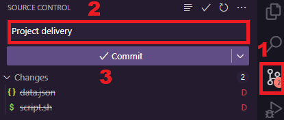
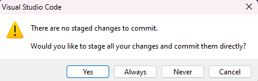
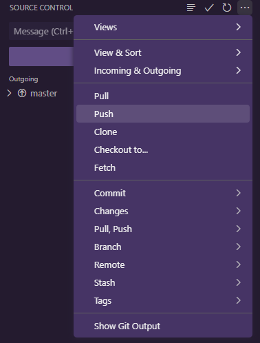

# `05` Entrega tu trabajo

Este paso es consiste en ejecutar un script de verificación para validar lo solicitado en ésta práctica, para ello sigue los siguientes pasos:

## 1. Habilitar el puerto público

Para que learnpack pueda recibir la información que se enviará desde tu maquina, es necesario habilitar el acceso público del puerto, que por seguridad viene privado por defecto.

Para ello selecciona la pestaña "Puertos" en el panel inferior de codespace, ahi verás los puertos que se están utilizando. Necesitas publicar el puerto `3001` y para ello has click con el botón derecho del mouse en el puerto, ve al menú `Visibilidad del puerto` y selecciona la opción `Público`

## 2. Ejecuta el script de validación `validate-update-script.sh`

Una vez que hayas ejecutado el script para verlo funcionar, y lo hayas agregado las tareas cron, es hora de validar.

En el escritorio de tu máquina Debian conseguirás una carpeta llamada `cybersecurity-scripts` y dentro una correspondiente al modulo `02-linux`. Dentro de esta carpeta debes ejecutar con bash el script `validate-update-script.sh`. Al ejecutarlo te solicitará la ruta exacta de tu script y la dirección de learnpack que puedes ver en el archivo `url.txt` de este repositorio.

Si todo sale bien, en la terminal verás un mensaje confirmándote que los datos fueron enviados. 

## 3. Carga tus resultados

Una vez ejecutado el script con éxito, podrás cargar tus resultados. Para hacerlo debes generar un commit de este repositorio y subir los cambios a github.

El primer paso es ir al icono de control de version y generar un nuevo commit. Para ello debes colocar un mensaje y hacer click en el botton `Commit`

Probablemente te pida que aceptes agregar los cambios recientes a tu commit. Puedes omitir esta acción en el futuro se seleccionas la opcion `Always`

Por ultimo vas a hacer un push para subir los cambios de tu instancia local hacia github

## 4. ¡Listo!

Si tienes algún problema no dudes en recurrir a un mentor o a los demás canales de apoyo que te ofrece 4Geeks.
